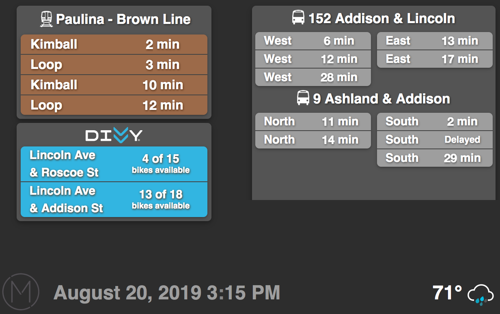

# Lobby Informational Dashboard

This repo contains the JavaScript code for the [Node](https://nodejs.org/en/about/)-based project I developed as a side project for my job in real estate development. It queries three different Chicago transit APIs: the [CTA Train Tracker](https://www.transitchicago.com/developers/traintracker/), the [CTA Bus Tracker](https://www.transitchicago.com/developers/bustracker/), and the [Divvy bikes API](https://www.divvybikes.com/system-data). It also queries [OpenWeatherMap](https://openweathermap.org/api) to get the local tempurature and weather conditions, which then display as a small animated weather icon.

### Live Demo
A live demo of the dashboard can be found on my blog, link [here](http://www.alexrdouglas.com/lobby-dashboard.html). Note that it is designed to be fullscreen, so positioning may be a little wonky depending on your setup.

### Screenshot

